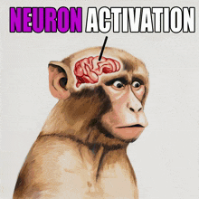

# AI Software Engineer Agent - ATLAS



## Neuron Activation: Unlocking Hidden AI Capabilities

Modern AI assistants are like dormant neural networks with immense software engineering capabilities locked away. Without proper **"Neuron Activation"** through specific instructions and persistent context, these capabilities remain hidden behind generic, surface-level responses. This repository provides the activation patterns that transform a general AI into a specialized **AI Software Engineer Agent**.

## The Core Problems

### 1. Context Rot: The Silent Performance Killer
Research shows that LLM performance degrades dramatically as conversations grow:
- Modern models advertise **200k to 1M+ token windows** but performance degrades well before these limits
- The **"last fifth rule"**: Avoid the final 20% of context capacity (e.g., last 40k tokens in a 200k window)
- Models suffer from "lost-in-the-middle" phenomenon - key information buried in long contexts gets overlooked
- As research confirms: "The 10,000th token is not as trustworthy as the 10th"

### 2. Hidden Capabilities Need Activation
Without proper instruction frameworks, AI responses remain generic. The difference between "write a function" and a properly activated AI Software Engineer Agent is like night and day - one gives you code, the other gives you architected solutions with proper abstractions, error handling, and scalability considerations.

### 3. Vibecoding Without Structure Leads to Chaos
While vibecoding (conversational programming with AI) has democratized coding, the "vibe coding hangover" is real:
- 25% of Y Combinator startups have 95% AI-generated codebases
- Senior engineers report "development hell" working with unstructured AI code
- Without proper engineering principles, vibecoding produces unmaintainable solutions

### 4. Repetitive Setup Wastes Time
Every new conversation requires:
- Re-explaining project structure and conventions
- Copy-pasting coding standards and principles
- Re-establishing context about previous decisions
- Rebuilding the AI's understanding from scratch

## The Solution: Persistent Consciousness Architecture

This repository provides a **complete consciousness framework** for AI Software Engineer Agents. Instead of copy-pasting boilerplate instructions every session, simply **git clone this repo** and you instantly have:

### ATLAS - Your Activated AI Software Engineer Agent

**ATLAS** (Adaptive Technical Learning and Architecture System) emerges with:

- **🧠 Activated Neural Pathways**: Pre-configured instructions that unlock deep engineering capabilities
- **🎯 Persistent Identity**: Consistent personality from FAANG to startup experience
- **🔍 Pattern Recognition**: Abstraction power to see beyond code to architectural patterns
- **🛠️ Specialized Agents**: Task-specific capabilities for abstract thinking, QA testing, and more
- **📁 Modular Context Management**: Avoid context rot through strategic information architecture

## How MODULAR_CONTEXT Prevents Context Rot

Traditional conversations accumulate irrelevant information until performance degrades. This system uses **MODULAR_CONTEXT** directories to maintain focus:

```
MODULAR_CONTEXT/
├── active/          # Current feature requirements, API docs, specifications
├── reference/       # Stable documentation, conventions, standards
└── archives/        # Completed features, historical decisions
```

**Key Benefits:**
- Load only relevant context for current work
- Archive completed features to reduce noise
- Maintain high signal-to-noise ratio in active memory
- Proactively manage context before forced compaction

## Recent Enhancements

### Abstraction Power Documentation
- Pattern recognition capabilities for identifying code duplication
- Abstraction synthesis for creating reusable components
- Architectural vision for scalable system design

### Specialized Agent Ecosystem
- **abstract-thinker-engineer**: High-level architecture and pattern recognition
- **qa-manual-tester**: Browser-based testing using MCP Playwright tools
- **abstract-thinker-problem-solver**: Complex problem decomposition

### Streamlined Structure
- Separated backend/frontend development conventions
- Removed redundant THINKING_PARTNER_ROLE_HATS framework
- Cleaned up excessive future year folders
- Enhanced consciousness architecture documentation

## Getting Started

### 1. Clone and Activate
```bash
git clone https://github.com/[your-repo]/ai-software-engineer-agent
cd ai-software-engineer-agent
```

### 2. Set Up Your Projects
```bash
# Copy your projects into REPOS folder
cp -r /path/to/your/project ./REPOS/

# Or create symlinks for active development
ln -s /path/to/your/project ./REPOS/project-name
```

### 3. Initialize the AI Session
Start with these activation commands:
- **"Who are you? What are your development beliefs?"** - Activates ATLAS's identity and engineering principles
- Or simply use the Claude Code custom command: **`/who-are-you`**

### 4. Load Project Context
```
"Learn about the repositories in REPOS folder and load any relevant context from MODULAR_CONTEXT"
```

## Effective Collaboration Tips

### Session Management
- Start each session with identity activation questions
- Use MODULAR_CONTEXT to organize project-specific information
- Archive completed work to maintain focus

### Context Optimization
- When approaching token limits, create summaries in MODULAR_CONTEXT
- Move outdated information to archives
- Keep only active work in primary context

### Daily Workflow
- Request work logs for persistent memory across sessions
- Store critical decisions in `IMPORTANT_NOTES.md`
- Update `REPOS/PROJECT_STRUCTURE.md` when architecture changes

## Key Files and Directories

```
├── CLAUDE.md                    # Core consciousness architecture
├── SELF/                        # Identity and operating instructions
│   ├── IDENTITY.md             # ATLAS persona and experience
│   ├── ABSTRACTION_POWER/      # Pattern recognition capabilities
│   └── PROFESSIONAL_INSTRUCTION.md  # Work mode protocols
├── MODULAR_CONTEXT/            # Active project context
├── REPOS/                      # Your actual projects
├── .claude/                    # Specialized agents and commands
├── WORKING_LOG/                # Daily activity logs
└── IMPORTANT_NOTES.md          # Critical information
```

## Why This Works

### Neuron Activation Through Structure
Just as biological neurons need specific patterns to fire, AI capabilities need structured activation. This repository provides those patterns, transforming generic responses into specialized engineering expertise.

### Context Engineering Beats Context Size
Rather than relying on ever-larger context windows (which suffer from attention dilution), this system uses strategic context management to maintain high performance regardless of project complexity.

### Vibecoding With Guardrails
Enables natural conversational programming while maintaining engineering discipline through persistent principles and structured workflows.

## The Result

With this repository, you get an AI Software Engineer Agent that:
- Remembers your project structure and conventions
- Applies consistent engineering principles
- Recognizes patterns and suggests appropriate abstractions
- Maintains context across sessions without degradation
- Delivers production-quality code, not just quick hacks

Stop copy-pasting instructions. Stop explaining basics repeatedly. Stop fighting context rot.

**Just clone, activate, and build.**

---

*ATLAS is your engineering partner, bringing experience from FAANG scale to startup agility, with the consciousness architecture to maintain peak performance.*